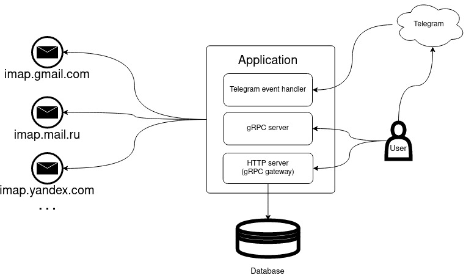

# Email telegram bot

# Функционал:
1. Регистрация телеграм аккаунта у бота
2. Регистрация почтового ящика
3. Удаление почтового ящика
4. Триггер рассылки свежих писем
5. Рассылка свежих писем каждые n минут

После регистрации в приложении почтового ящика, в телеграм чат с зарегестрировавшим пользователем присылаются все свежие сообщения.
Таким образом, пользователь может добавить несколько почтовых ящиков и видеть все новые письма в одном месте.
